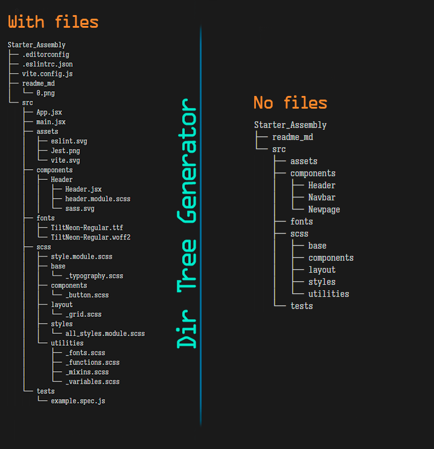
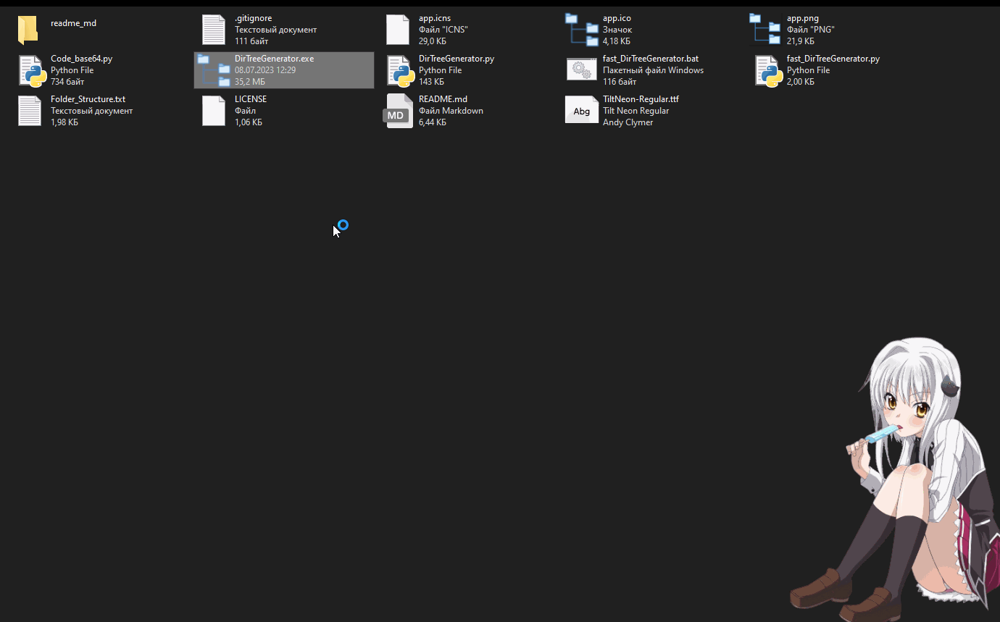

  

  

    <!-- 

        

            
        

        

            
        

    
 -->
    

        <!-- 

            
        
 -->
        

            
        

    

 

    
---------------------------------------------:us: :us: :us: ENGLISH :us: :us: :us:---------------------------------------------

     

## Visual directory and file structure generator.
#### This program creates a visual file system directory by displaying files and folders in a hierarchical tree structure.

#### How to use:
- Just copy your directory path and paste it in the app **[DirTreeGenerator.exe](https://github.com/brendan8c/Dir_Tree_Generator/releases)**
- Please note that initially the application was told to ignore such directories as: **.git**, **.vscode**, **node_modules** and will also ignore all files and subdirectories within those folders. You have the ability to add or remove directories.
- You can enable the checkbox (No files), after that the program will consider only directories, all files will be ignored.
- Also you can use file instead of application **fast_DirTreeGenerator.bat**.
  In order to add or remove a directory, you will need to edit the file **fast_DirTreeGenerator.py** variable value `IGNORED_FOLDERS = ['.git', '.vscode', 'node_modules']`.

  

- If you want to build the project yourself, use these keys.  
For Linux: `pyinstaller --onefile --windowed --icon=app.png DirTreeGenerator.py`  
For macOS: `pyinstaller --onefile --windowed --icon=app.icns DirTreeGenerator.py`  
For Windows: `pyinstaller --onefile --windowed --icon=app.ico DirTreeGenerator.py`  

- Install required dependencies:  
`pip install pyinstaller`, `pip install pyqt5`  

- In order to add your font, you need to convert it to base64 format, for this, in the file **Code_base64.py** edit this line `font_file = "TiltNeon-Regular.ttf"` by changing the value of the variable to the name of your font., Run this file, after which it will create a text file **Font_base64.txt** which will contain the encoding you need., then in the file **DirTreeGenerator\.py** change the value of the variable `base64_font = 'your_base64_here'` to your base64 characters.  
- To change the file icon for the Windows taskbar, you also need to convert it to base64 format by specifying your icon file in place of `font_file = "TiltNeon-Regular.ttf"` in the **Code_base64.py** file. Then you can change it in the `base64_icon = 'your_base64_here'` variable.  

- If you have any suggestions or questions, you can ask them in this repository! :speech_balloon:  
- Please contribute to this project! :wink:  

    
---------------------------------------------:ru: :ru: :ru: RUSSIAN :ru: :ru: :ru:---------------------------------------------

     

## Генератор визуальной структуры каталогов и файлов.
#### Эта программа создает визуальный каталог файловой системы, отображая файлы и папки в виде иерархической древовидной структуры.

#### Как использовать:
- Просто скопируйте ваш путь к каталогу и вставьте его в приложении **[DirTreeGenerator.exe](https://github.com/brendan8c/Dir_Tree_Generator/releases)**
- Обратите внимание изначально в приложении указано игнорировать такие каталоги как: **.git**, **.vscode**, **node_modules** а также будут проигнорированы все файлы и подкаталоги внутри этих папок. У вас есть возможность добавлять или удалять каталоги.
- Вы может включить чекбокс (No files), после этого программа будет учитывать только каталоги, все файлы будут проигнорированы.
- Также вы можете использовать вместо приложения файл **fast_DirTreeGenerator.bat**.
  Для того чтобы добавить или удалить каталог, вам нужно будет отредактировать в файле **fast_DirTreeGenerator.py** значение переменной `IGNORED_FOLDERS = ['.git', '.vscode', 'node_modules']`.

  

- Если вы хотите сами собрать проект используйте эти ключи.  
Для Linux: `pyinstaller --onefile --windowed --icon=app.png DirTreeGenerator.py`  
Для macOS: `pyinstaller --onefile --windowed --icon=app.icns DirTreeGenerator.py`  
Для Windows: `pyinstaller --onefile --windowed --icon=app.ico DirTreeGenerator.py`  

- Установите необходимые зависимости:  
`pip install pyinstaller`, `pip install pyqt5`  

- Для того чтобы добавить свой шрифт, вам нужно преобразовать его в формат base64, для этого в файле **Code_base64.py** отредактируйте эту строку `font_file = "TiltNeon-Regular.ttf"` изменив значение переменной на название вашего шрифта., Запустите данный файл, после чего он создаст текстовый файл **Font_base64.txt** который будет содержать нужную вам кодировку., Затем в файле **DirTreeGenerator\.py** измените значение переменной `base64_font = 'your_base64_here'` на ваши символы base64.  
- Чтобы изменить иконку файла для панели задач в Windows вам так-же нужно преобразовать её в формат base64, указав в файле **Code_base64.py** за место `font_file = "TiltNeon-Regular.ttf"` ваш файл с иконкой. После чего вы сожете изменить её в переменной `base64_icon = 'your_base64_here'`.  

- Если у вас есть какие-то предложения или вопросы вы можете их задать в этом репозитории! :speech_balloon:  
- Делайте свой вклад в этот проект! :wink:  

